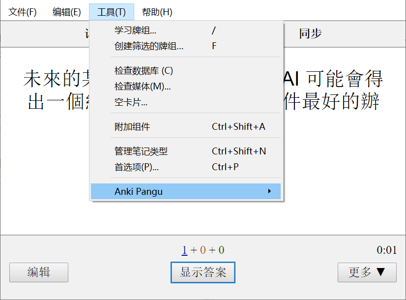
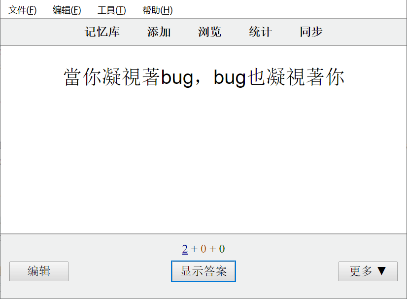

# anki-pangu (Paranoid text spacing in Anki.)

Paranoid text spacing for good readability, to automatically insert whitespace between CJK (Chinese, Japanese, Korean) and half-width characters (alphabetical letters, numerical digits and symbols).

**The function button is located in the *Tools-Anki Pangu***. When you learn cards, you can trigger their functions by clicking on them.

**Tips: Don't modify database data**

# Usage Effect

# Installation

[See in the AnkiWeb](https://ankiweb.net/shared/info/79544508)
